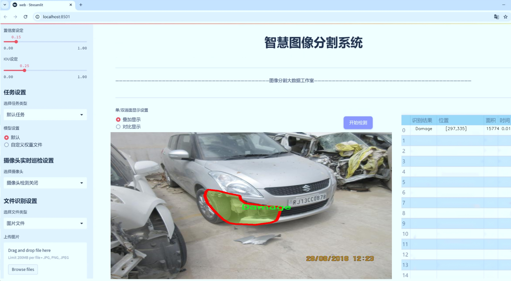
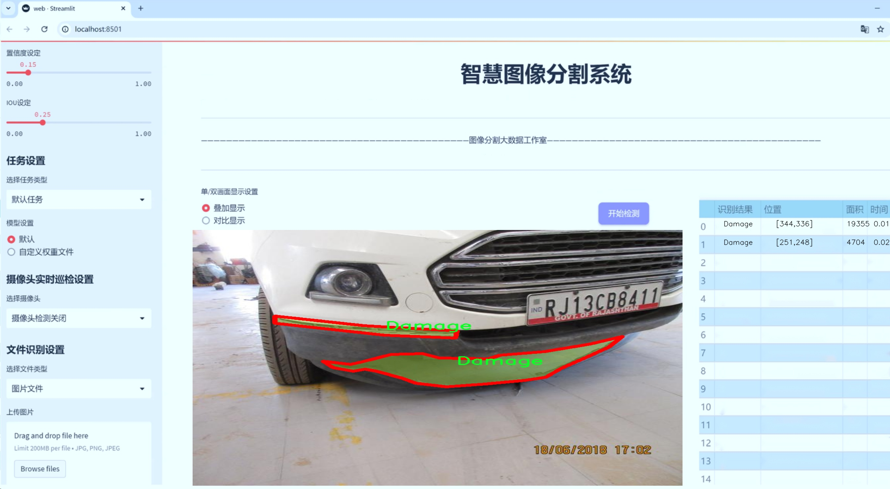
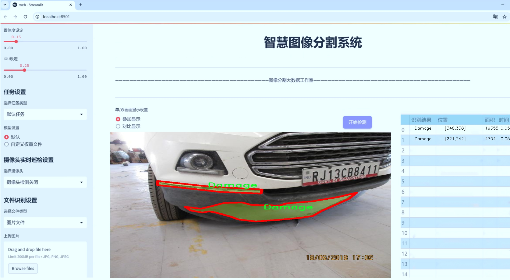
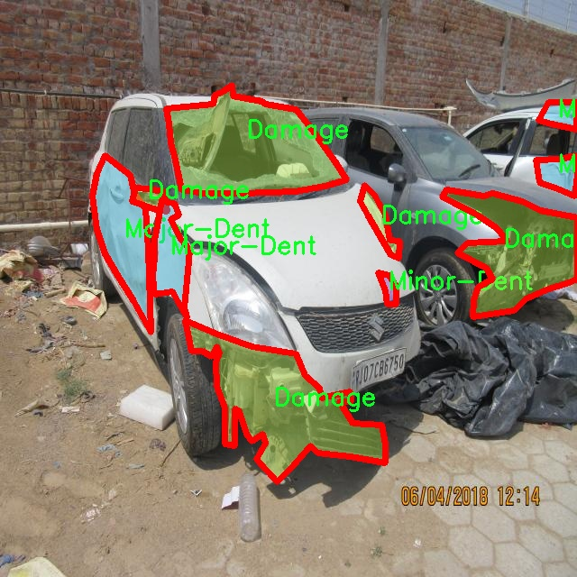
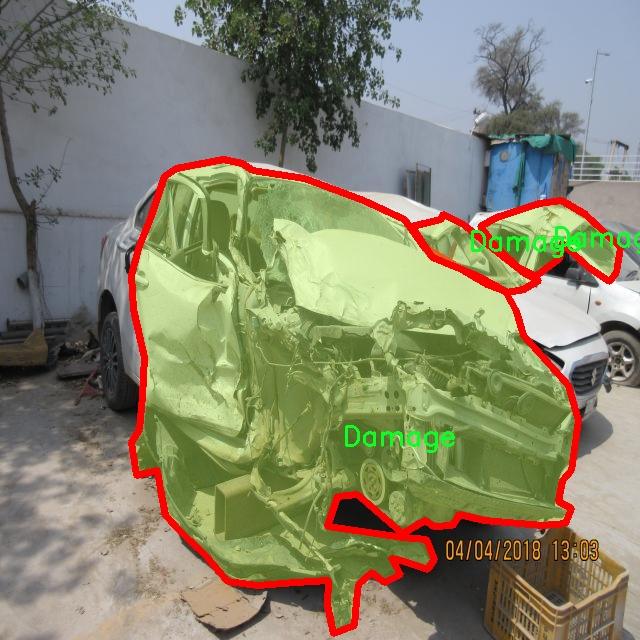
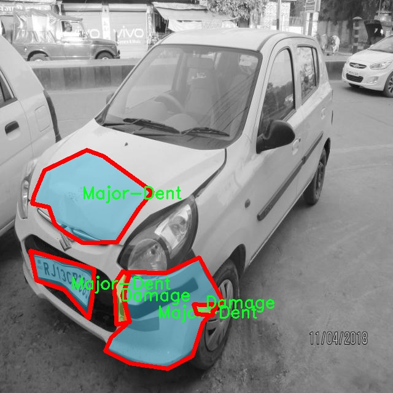
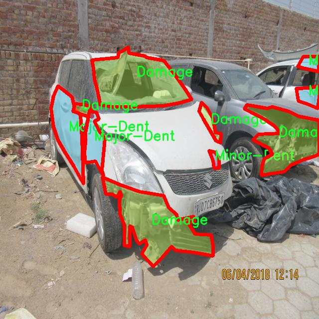
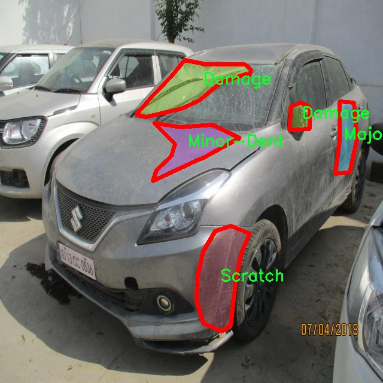

# 汽车损伤图像分割系统源码＆数据集分享
 [yolov8-seg-LAWDS＆yolov8-seg-EfficientHead等50+全套改进创新点发刊_一键训练教程_Web前端展示]

### 1.研究背景与意义

项目参考[ILSVRC ImageNet Large Scale Visual Recognition Challenge](https://gitee.com/YOLOv8_YOLOv11_Segmentation_Studio/projects)

项目来源[AAAI Global Al lnnovation Contest](https://kdocs.cn/l/cszuIiCKVNis)

研究背景与意义

随着汽车工业的迅猛发展，汽车损伤问题日益突出，尤其是在交通事故频发的背景下，汽车损伤的检测与评估显得尤为重要。传统的汽车损伤评估方法多依赖于人工检查，不仅效率低下，而且容易受到主观因素的影响，导致评估结果的不准确。因此，开发一种高效、准确的汽车损伤图像分割系统，能够为汽车维修行业提供可靠的技术支持，具有重要的现实意义。

近年来，深度学习技术的快速发展为图像处理领域带来了革命性的变化。尤其是目标检测与图像分割技术的进步，使得计算机能够更好地理解和分析图像内容。YOLO（You Only Look Once）系列模型作为一种实时目标检测算法，因其高效性和准确性被广泛应用于各类视觉任务中。YOLOv8作为该系列的最新版本，进一步提升了检测精度和速度，为汽车损伤图像的自动化处理提供了新的可能性。然而，现有的YOLOv8模型在处理复杂背景和多种损伤类型时，仍然存在一定的局限性。因此，基于改进YOLOv8的汽车损伤图像分割系统的研究，旨在提升模型在汽车损伤检测中的应用效果。

本研究所使用的数据集“Fusion-Car-Damage”包含1500张汽车损伤图像，涵盖了四种损伤类别：损伤、重大凹陷、轻微凹陷和划痕。这一数据集的多样性和丰富性为模型的训练与评估提供了良好的基础。通过对不同类型的损伤进行精确分割，研究能够帮助维修人员快速识别损伤程度，从而制定相应的维修方案，提升维修效率。此外，数据集中不同类别的损伤图像能够为模型的学习提供多样化的样本，增强模型的泛化能力。

在汽车损伤评估领域，准确的图像分割不仅有助于损伤的定量分析，还能为保险理赔、事故责任判定等提供数据支持。通过建立基于改进YOLOv8的汽车损伤图像分割系统，研究将为汽车行业提供一种新的智能化解决方案，推动汽车维修和保险行业的数字化转型。同时，该系统的成功应用也将为其他领域的图像分割任务提供借鉴，促进深度学习技术在实际应用中的广泛推广。

综上所述，基于改进YOLOv8的汽车损伤图像分割系统的研究，不仅具有重要的学术价值，也具备显著的社会和经济意义。通过提升汽车损伤检测的自动化水平，研究将为行业发展提供新的动力，推动智能交通和智能汽车的进步。

### 2.图片演示







##### 注意：由于此博客编辑较早，上面“2.图片演示”和“3.视频演示”展示的系统图片或者视频可能为老版本，新版本在老版本的基础上升级如下：（实际效果以升级的新版本为准）

  （1）适配了YOLOV8的“目标检测”模型和“实例分割”模型，通过加载相应的权重（.pt）文件即可自适应加载模型。

  （2）支持“图片识别”、“视频识别”、“摄像头实时识别”三种识别模式。

  （3）支持“图片识别”、“视频识别”、“摄像头实时识别”三种识别结果保存导出，解决手动导出（容易卡顿出现爆内存）存在的问题，识别完自动保存结果并导出到tempDir中。

  （4）支持Web前端系统中的标题、背景图等自定义修改，后面提供修改教程。

  另外本项目提供训练的数据集和训练教程,暂不提供权重文件（best.pt）,需要您按照教程进行训练后实现图片演示和Web前端界面演示的效果。

### 3.视频演示

[3.1 视频演示](https://www.bilibili.com/video/BV1oByzYxEDK/)

### 4.数据集信息展示

##### 4.1 本项目数据集详细数据（类别数＆类别名）

nc: 4
names: ['Damage', 'Major-Dent', 'Minor-Dent', 'Scratch']


##### 4.2 本项目数据集信息介绍

数据集信息展示

在本研究中，我们使用了名为“Fusion-Car-Damage”的数据集，以支持对汽车损伤图像分割系统的训练，特别是针对改进YOLOv8-seg模型的应用。该数据集的设计旨在为汽车损伤检测和分割提供丰富而多样的样本，确保模型在实际应用中的有效性和准确性。数据集包含四个主要类别，分别是“Damage”、“Major-Dent”、“Minor-Dent”和“Scratch”，这些类别涵盖了汽车表面可能出现的多种损伤类型。

“Damage”类别是数据集的总称，代表了所有类型的汽车损伤。这一类别的样本通常包括不同程度的损伤情况，能够帮助模型学习如何识别和分割汽车表面上的各种损伤特征。接下来的“Major-Dent”类别则专注于较为严重的凹陷，通常伴随着明显的形状变化和表面破损。这类损伤在视觉上更为显著，因此对于模型的训练至关重要，因为它能够帮助模型在面对明显损伤时做出准确的判断。

“Minor-Dent”类别则涵盖了较轻微的凹陷，通常不如“Major-Dent”明显，但仍然需要被有效识别。此类别的样本提供了对模型的挑战，因为这些轻微的损伤往往与正常的汽车表面特征相似，要求模型具备更高的分辨率和细致的特征提取能力。最后，“Scratch”类别则专注于划痕，这种损伤在汽车表面上较为常见，且可能影响汽车的外观和价值。划痕的识别对于维护汽车的外观至关重要，因此在数据集中占有重要地位。

“Fusion-Car-Damage”数据集的构建不仅考虑了损伤类型的多样性，还注重样本的质量和数量。每个类别均包含大量的标注图像，确保模型在训练过程中能够接触到丰富的特征变异。这种多样性有助于提高模型的泛化能力，使其在面对不同类型的汽车损伤时，能够做出准确的分割和识别。此外，数据集中的图像涵盖了不同的汽车品牌、颜色和损伤环境，这进一步增强了模型的适应性。

为了确保数据集的有效性，所有图像均经过严格的标注和审核，确保每个损伤类别的准确性和一致性。这一过程不仅提高了数据集的质量，也为后续的模型训练和评估提供了可靠的基础。通过使用“Fusion-Car-Damage”数据集，我们的目标是构建一个高效的汽车损伤图像分割系统，能够在实际应用中快速、准确地识别和分割汽车表面的损伤，从而为汽车维修和保险理赔等领域提供有力支持。

总之，“Fusion-Car-Damage”数据集的设计和构建为改进YOLOv8-seg模型提供了坚实的基础。通过对汽车损伤的全面覆盖和细致标注，该数据集不仅提升了模型的训练效果，也为未来的研究和应用开辟了新的方向。











### 5.全套项目环境部署视频教程（零基础手把手教学）

[5.1 环境部署教程链接（零基础手把手教学）](https://www.bilibili.com/video/BV1jG4Ve4E9t/?vd_source=bc9aec86d164b67a7004b996143742dc)


[5.2 安装Python虚拟环境创建和依赖库安装视频教程链接（零基础手把手教学）](https://www.bilibili.com/video/BV1nA4VeYEze/?vd_source=bc9aec86d164b67a7004b996143742dc)

### 6.手把手YOLOV8-seg训练视频教程（零基础小白有手就能学会）

[6.1 手把手YOLOV8-seg训练视频教程（零基础小白有手就能学会）](https://www.bilibili.com/video/BV1cA4VeYETe/?vd_source=bc9aec86d164b67a7004b996143742dc)


按照上面的训练视频教程链接加载项目提供的数据集，运行train.py即可开始训练



     Epoch   gpu_mem       box       obj       cls    labels  img_size
     1/200     0G   0.01576   0.01955  0.007536        22      1280: 100%|██████████| 849/849 [14:42<00:00,  1.04s/it]
               Class     Images     Labels          P          R     mAP@.5 mAP@.5:.95: 100%|██████████| 213/213 [01:14<00:00,  2.87it/s]
                 all       3395      17314      0.994      0.957      0.0957      0.0843

     Epoch   gpu_mem       box       obj       cls    labels  img_size
     2/200     0G   0.01578   0.01923  0.007006        22      1280: 100%|██████████| 849/849 [14:44<00:00,  1.04s/it]
               Class     Images     Labels          P          R     mAP@.5 mAP@.5:.95: 100%|██████████| 213/213 [01:12<00:00,  2.95it/s]
                 all       3395      17314      0.996      0.956      0.0957      0.0845

     Epoch   gpu_mem       box       obj       cls    labels  img_size
     3/200     0G   0.01561    0.0191  0.006895        27      1280: 100%|██████████| 849/849 [10:56<00:00,  1.29it/s]
               Class     Images     Labels          P          R     mAP@.5 mAP@.5:.95: 100%|███████   | 187/213 [00:52<00:00,  4.04it/s]
                 all       3395      17314      0.996      0.957      0.0957      0.0845


### 7.50+种全套YOLOV8-seg创新点代码加载调参视频教程（一键加载写好的改进模型的配置文件）

[7.1 50+种全套YOLOV8-seg创新点代码加载调参视频教程（一键加载写好的改进模型的配置文件）](https://www.bilibili.com/video/BV1Hw4VePEXv/?vd_source=bc9aec86d164b67a7004b996143742dc)

### 8.YOLOV8-seg图像分割算法原理

原始YOLOv8-seg算法原理

YOLOv8-seg算法是Ultralytics团队在YOLOv5的基础上发展而来的一个先进的目标检测与分割模型。自2023年1月提出以来，该算法通过整合过去两年半内在实际应用中验证的多项改进，显著提升了目标检测的精度和速度。YOLOv8-seg不仅继承了YOLO系列模型的单阶段检测特性，还引入了针对图像分割的优化，旨在实现更高效的目标识别和分割任务。

YOLOv8-seg的网络结构分为三个主要部分：Backbone、Neck和Head。Backbone部分负责特征提取，采用了一系列卷积和反卷积层，通过残差连接和瓶颈结构来优化网络的大小和性能。YOLOv8-seg在这一部分使用了C2f模块替代了传统的C3模块，C2f模块的设计灵感来源于YOLOv7中的ELAN结构，增加了跳层连接的数量，从而使得梯度流动更加丰富。这种设计不仅提升了特征提取的效率，还保持了模型的轻量化特性，使得YOLOv8-seg能够在资源受限的环境中运行。

在特征提取后，Neck部分通过多尺度特征融合技术，将来自Backbone不同阶段的特征图进行整合，以捕捉不同尺度目标的信息。这一过程通过特征金字塔和路径聚合网络的结合，进一步增强了语义特征与定位特征之间的转移能力，使得模型在处理复杂场景时表现得更加稳健。Neck的设计旨在提高目标检测的性能，尤其是在面对不同尺寸和形状的目标时，能够更好地适应变化。

Head部分则是YOLOv8-seg的核心，负责最终的目标检测和分割任务。与以往的YOLO系列模型不同，YOLOv8-seg采用了解耦头的结构，将回归分支和分类分支分开处理。这种设计使得模型在进行分类和定位时可以更专注于各自的任务，提升了收敛速度和预测精度。此外，YOLOv8-seg引入了无锚框结构，直接预测目标的中心位置，并通过任务对齐学习（Task Alignment Learning, TAL）来优化正负样本的区分。这一方法通过引入分类分数和IOU的高次幂乘积作为衡量任务对齐程度的指标，确保了模型在分类和定位任务中都能取得良好的表现。

在数据增强方面，YOLOv8-seg对Mosaic数据增强的使用进行了调整。尽管Mosaic增强能够提升模型的鲁棒性和泛化能力，但在训练的最后10个epoch中停止使用此方法，以避免破坏数据的真实分布。这一策略的实施使得模型在学习过程中能够更好地捕捉到真实数据的特征，从而提高了最终的检测精度。

YOLOv8-seg在性能上表现优异，尤其是在COCO数据集上的实验结果显示，其在不同尺寸的模型中均取得了较高的mAP（mean Average Precision）值，且在推理速度上也优于其他YOLO系列模型。这一系列的改进使得YOLOv8-seg在实时性和准确性之间找到了良好的平衡，适合应用于各种实际场景，尤其是在需要快速响应的任务中，如自动驾驶、视频监控和机器人视觉等。

总的来说，YOLOv8-seg算法通过对网络结构的创新和数据处理策略的优化，极大地提升了目标检测与分割的性能。其在特征提取、特征融合和任务处理上的多项改进，使得YOLOv8-seg不仅能够有效地识别和分割目标，还能在实际应用中展现出更高的效率和准确性。随着YOLOv8-seg的推广和应用，未来在智能视觉领域的研究和实践将会迎来更多的可能性。


### 9.系统功能展示（检测对象为举例，实际内容以本项目数据集为准）

图9.1.系统支持检测结果表格显示

  图9.2.系统支持置信度和IOU阈值手动调节

  图9.3.系统支持自定义加载权重文件best.pt(需要你通过步骤5中训练获得)

  图9.4.系统支持摄像头实时识别

  图9.5.系统支持图片识别

  图9.6.系统支持视频识别

  图9.7.系统支持识别结果文件自动保存

  图9.8.系统支持Excel导出检测结果数据


### 10.50+种全套YOLOV8-seg创新点原理讲解（非科班也可以轻松写刊发刊，V11版本正在科研待更新）

#### 10.1 由于篇幅限制，每个创新点的具体原理讲解就不一一展开，具体见下列网址中的创新点对应子项目的技术原理博客网址【Blog】：


[10.1 50+种全套YOLOV8-seg创新点原理讲解链接](https://gitee.com/qunmasj/good)

#### 10.2 部分改进模块原理讲解(完整的改进原理见上图和技术博客链接)【如果此小节的图加载失败可以通过CSDN或者Github搜索该博客的标题访问原始博客，原始博客图片显示正常】
### YOLOv8简介
#### Backbone


借鉴了其他算法的这些设计思想

借鉴了VGG的思想，使用了较多的3×3卷积，在每一次池化操作后，将通道数翻倍；

借鉴了network in network的思想，使用全局平均池化（global average pooling）做预测，并把1×1的卷积核置于3×3的卷积核之间，用来压缩特征；（我没找到这一步体现在哪里）

使用了批归一化层稳定模型训练，加速收敛，并且起到正则化作用。

    以上三点为Darknet19借鉴其他模型的点。Darknet53当然是在继承了Darknet19的这些优点的基础上再新增了下面这些优点的。因此列在了这里

借鉴了ResNet的思想，在网络中大量使用了残差连接，因此网络结构可以设计的很深，并且缓解了训练中梯度消失的问题，使得模型更容易收敛。

使用步长为2的卷积层代替池化层实现降采样。（这一点在经典的Darknet-53上是很明显的，output的长和宽从256降到128，再降低到64，一路降低到8，应该是通过步长为2的卷积层实现的；在YOLOv8的卷积层中也有体现，比如图中我标出的这些位置）

#### 特征融合

模型架构图如下

  Darknet-53的特点可以这样概括：（Conv卷积模块+Residual Block残差块）串行叠加4次

  Conv卷积层+Residual Block残差网络就被称为一个stage


上面红色指出的那个，原始的Darknet-53里面有一层 卷积，在YOLOv8里面，把一层卷积移除了

为什么移除呢？

        原始Darknet-53模型中间加的这个卷积层做了什么？滤波器（卷积核）的个数从 上一个卷积层的512个，先增加到1024个卷积核，然后下一层卷积的卷积核的个数又降低到512个

        移除掉这一层以后，少了1024个卷积核，就可以少做1024次卷积运算，同时也少了1024个3×3的卷积核的参数，也就是少了9×1024个参数需要拟合。这样可以大大减少了模型的参数，（相当于做了轻量化吧）

        移除掉这个卷积层，可能是因为作者发现移除掉这个卷积层以后，模型的score有所提升，所以才移除掉的。为什么移除掉以后，分数有所提高呢？可能是因为多了这些参数就容易，参数过多导致模型在训练集删过拟合，但是在测试集上表现很差，最终模型的分数比较低。你移除掉这个卷积层以后，参数减少了，过拟合现象不那么严重了，泛化能力增强了。当然这个是，拿着你做实验的结论，反过来再找补，再去强行解释这种现象的合理性。

过拟合


通过MMdetection官方绘制册这个图我们可以看到，进来的这张图片经过一个“Feature Pyramid Network(简称FPN)”，然后最后的P3、P4、P5传递给下一层的Neck和Head去做识别任务。 PAN（Path Aggregation Network）


“FPN是自顶向下，将高层的强语义特征传递下来。PAN就是在FPN的后面添加一个自底向上的金字塔，对FPN补充，将低层的强定位特征传递上去，

FPN是自顶（小尺寸，卷积次数多得到的结果，语义信息丰富）向下（大尺寸，卷积次数少得到的结果），将高层的强语义特征传递下来，对整个金字塔进行增强，不过只增强了语义信息，对定位信息没有传递。PAN就是针对这一点，在FPN的后面添加一个自底（卷积次数少，大尺寸）向上（卷积次数多，小尺寸，语义信息丰富）的金字塔，对FPN补充，将低层的强定位特征传递上去，又被称之为“双塔战术”。

FPN层自顶向下传达强语义特征，而特征金字塔则自底向上传达强定位特征，两两联手，从不同的主干层对不同的检测层进行参数聚合,这样的操作确实很皮。
#### 自底向上增强

而 PAN（Path Aggregation Network）是对 FPN 的一种改进，它的设计理念是在 FPN 后面添加一个自底向上的金字塔。PAN 引入了路径聚合的方式，通过将浅层特征图（低分辨率但语义信息较弱）和深层特征图（高分辨率但语义信息丰富）进行聚合，并沿着特定的路径传递特征信息，将低层的强定位特征传递上去。这样的操作能够进一步增强多尺度特征的表达能力，使得 PAN 在目标检测任务中表现更加优秀。


### 可重参化EfficientRepBiPAN优化Neck
#### Repvgg-style
Repvgg-style的卷积层包含
卷积+ReLU结构，该结构能够有效地利用硬件资源。

在训练时，Repvgg-style的卷积层包含
卷积、
卷积、identity。（下图左图）


在推理时，通过重参数化（re-parameterization），上述的多分支结构可以转换为单分支的
卷积。（下图右图）


基于上述思想，作者设计了对GPU硬件友好的EfficientRep Backbone和Rep-PAN Neck，将它们用于YOLOv6中。

EfficientRep Backbone的结构图：


Rep-PAN Neck结构图：


#### Multi-path
只使用repvgg-style不能达到很好的精度-速度平衡，对于大模型，作者探索了多路径的网络结构。

参考该博客提出了Bep unit，其结构如下图所示：


CSP（Cross Stage Partial）-style计算量小，且有丰富的梯度融合信息，广泛应用于YOLO系列中，比如YOLOv5、PPYOLOE。

作者将Bep unit与CSP-style结合，设计了一种新的网络结构BepC3，如下图所示：


基于BepC3模块，作者设计了新的CSPBep Backbone和CSPRepPAN Neck，以达到很好的精度-速度平衡。

其他YOLO系列在使用CSP-stype结构时，partial ratio设置为1/2。为了达到更好的性能，在YOLOv6m中partial ratio的值为2/3，在YOLOv6l中partial ratio的值为1/2。

对于YOLOv6m，单纯使用Rep-style结构和使用BepC3结构的对比如下图所示：

#### BIFPN
BiFPN 全称 Bidirectional Feature Pyramid Network 加权双向（自顶向下 + 自低向上）特征金字塔网络。

相比较于PANet，BiFPN在设计上的改变：

总结下图：
图d 蓝色部分为自顶向下的通路，传递的是高层特征的语义信息；红色部分是自底向上的通路，传递的是低层特征的位置信息；紫色部分是上述第二点提到的同一层在输入节点和输入节点间新加的一条边。


我们删除那些只有一条输入边的节点。这么做的思路很简单：如果一个节点只有一条输入边而没有特征融合，那么它对旨在融合不同特征的特征网络的贡献就会很小。删除它对我们的网络影响不大，同时简化了双向网络；如上图d 的 P7右边第一个节点

如果原始输入节点和输出节点处于同一层，我们会在原始输入节点和输出节点之间添加一条额外的边。思路：以在不增加太多成本的情况下融合更多的特性；

与只有一个自顶向下和一个自底向上路径的PANet不同，我们处理每个双向路径(自顶向下和自底而上)路径作为一个特征网络层，并重复同一层多次，以实现更高层次的特征融合。如下图EfficientNet 的网络结构所示，我们对BiFPN是重复使用多次的。而这个使用次数也不是我们认为设定的，而是作为参数一起加入网络的设计当中，使用NAS技术算出来的。


Weighted Feature Fusion 带权特征融合：学习不同输入特征的重要性，对不同输入特征有区分的融合。
设计思路：传统的特征融合往往只是简单的 feature map 叠加/相加 (sum them up)，比如使用concat或者shortcut连接，而不对同时加进来的 feature map 进行区分。然而，不同的输入 feature map 具有不同的分辨率，它们对融合输入 feature map 的贡献也是不同的，因此简单的对他们进行相加或叠加处理并不是最佳的操作。所以这里我们提出了一种简单而高效的加权特融合的机制。
常见的带权特征融合有三种方法，分别是：


​
  这种方法比较简单，直接加一个可学习的权重。但是由于这个权重不受限制，所有可能引起训练的不稳定，所有并不推荐。
Softmax-based fusion: O = ∑ i e w i ∗ I i ϵ + ∑ j e w j O = \sum_{i} \frac{e^{w_i} * I_i}{ \epsilon+\sum_{j}e^{w_j}}O=∑ 

 

​
  使用这种方法可以将范围放缩到 [ 0 , 1 ] [0, 1][0,1] 之间，训练稳定，但是训练很慢，所有也不推荐。
Fast normalized fusion: O = ∑ i w i ∗ I i ϵ + ∑ j w j O = \sum_{i} \frac{w_i * I_i}{ \epsilon+\sum_{j}w_j}O=∑ 


### 11.项目核心源码讲解（再也不用担心看不懂代码逻辑）

#### 11.1 ultralytics\cfg\__init__.py

以下是经过精简和注释的核心代码部分，保留了主要功能和逻辑：

```python
# 导入必要的库
import sys
from pathlib import Path
from types import SimpleNamespace
from typing import Dict, Union
from ultralytics.utils import yaml_load, LOGGER, DEFAULT_CFG_DICT, checks, colorstr

# 定义有效的任务和模式
MODES = 'train', 'val', 'predict', 'export', 'track', 'benchmark'
TASKS = 'detect', 'segment', 'classify', 'pose'

def cfg2dict(cfg):
    """
    将配置对象转换为字典格式，可以是文件路径、字符串或SimpleNamespace对象。

    Args:
        cfg (str | Path | dict | SimpleNamespace): 要转换的配置对象。

    Returns:
        cfg (dict): 转换后的字典格式配置对象。
    """
    if isinstance(cfg, (str, Path)):
        cfg = yaml_load(cfg)  # 从文件加载字典
    elif isinstance(cfg, SimpleNamespace):
        cfg = vars(cfg)  # 转换为字典
    return cfg

def get_cfg(cfg: Union[str, Path, Dict, SimpleNamespace] = DEFAULT_CFG_DICT, overrides: Dict = None):
    """
    加载并合并配置数据。

    Args:
        cfg (str | Path | Dict | SimpleNamespace): 配置数据。
        overrides (str | Dict | optional): 覆盖配置的字典。默认为None。

    Returns:
        (SimpleNamespace): 训练参数的命名空间。
    """
    cfg = cfg2dict(cfg)  # 转换配置为字典

    # 合并覆盖
    if overrides:
        overrides = cfg2dict(overrides)
        cfg = {**cfg, **overrides}  # 合并cfg和overrides字典

    # 返回命名空间
    return SimpleNamespace(**cfg)

def entrypoint(debug=''):
    """
    入口函数，负责解析传递给包的命令行参数。

    Args:
        debug (str): 调试信息，默认为空。
    """
    args = (debug.split(' ') if debug else sys.argv)[1:]  # 获取命令行参数
    if not args:  # 如果没有参数
        LOGGER.info("请提供有效的参数。")
        return

    overrides = {}  # 存储覆盖参数
    for a in args:
        if '=' in a:
            k, v = a.split('=', 1)  # 解析参数
            overrides[k] = v  # 存储覆盖参数
        elif a in TASKS:
            overrides['task'] = a  # 存储任务
        elif a in MODES:
            overrides['mode'] = a  # 存储模式

    # 检查模式和任务
    mode = overrides.get('mode', 'predict')  # 默认模式为predict
    task = overrides.get('task', None)  # 获取任务

    # 根据模式和任务执行相应的操作
    if mode == 'train':
        LOGGER.info(f"开始训练任务: {task}")
        # 这里可以调用训练函数
    elif mode == 'predict':
        LOGGER.info(f"开始预测任务: {task}")
        # 这里可以调用预测函数

if __name__ == '__main__':
    entrypoint(debug='')  # 调用入口函数
```

### 代码注释说明：
1. **导入库**：导入了必要的库和模块，包括系统库、路径处理库和Ultralytics库的工具函数。
2. **任务和模式定义**：定义了可用的任务（如检测、分割等）和模式（如训练、验证等）。
3. **cfg2dict函数**：将不同类型的配置对象转换为字典格式，方便后续处理。
4. **get_cfg函数**：加载配置并合并覆盖参数，返回一个命名空间对象，方便访问配置参数。
5. **entrypoint函数**：处理命令行参数，解析任务和模式，并根据模式执行相应的操作。
6. **主程序入口**：调用`entrypoint`函数，开始程序执行。

这个精简版本保留了核心逻辑，去掉了冗余的部分，并添加了详细的中文注释以帮助理解。

这个文件是Ultralytics YOLO（You Only Look Once）模型的配置模块，主要用于处理模型的配置、命令行参数解析和执行相应的任务。文件中包含了一系列的函数和常量，用于支持不同的任务和模式，如训练、验证、预测、导出等。

首先，文件导入了一些必要的库和模块，包括路径处理、类型检查、日志记录等。接着，定义了一些有效的任务和模式，例如训练（train）、验证（val）、预测（predict）、导出（export）、跟踪（track）和基准测试（benchmark）。每种任务都有对应的数据集、模型和评估指标的映射。

文件中还定义了一个CLI帮助信息字符串，提供了如何使用命令行接口（CLI）来执行不同任务的示例，包括训练模型、进行预测、验证模型等。用户可以通过命令行传递参数，指定任务和模式，并覆盖默认配置。

接下来，文件定义了一些用于类型检查的键，包括浮点数、整数、布尔值等，以确保用户输入的配置参数符合预期的类型和范围。然后，提供了`cfg2dict`函数，用于将配置对象转换为字典格式，支持字符串、路径、字典和`SimpleNamespace`对象。

`get_cfg`函数用于加载和合并配置数据，支持从文件或字典中读取配置，并允许用户通过覆盖参数来修改默认配置。函数内部会进行类型和数值的检查，确保配置的有效性。

`get_save_dir`函数根据用户的输入返回保存目录，确保在训练或验证时能够正确保存模型和结果。`_handle_deprecation`函数用于处理过时的配置键，发出警告并将其替换为新的键。

`check_dict_alignment`函数用于检查自定义配置与基础配置之间的键是否匹配，确保用户输入的参数有效。`merge_equals_args`函数则用于合并命令行参数中的等号分隔的键值对。

`handle_yolo_hub`和`handle_yolo_settings`函数分别处理与Ultralytics HUB相关的命令和YOLO设置管理的命令。它们允许用户登录、登出和重置设置等操作。

`entrypoint`函数是整个模块的入口点，负责解析命令行参数并调用相应的功能。它会检查输入的参数，确保任务和模式的有效性，并根据用户的输入执行相应的模型操作。

最后，文件还提供了一个`copy_default_cfg`函数，用于复制默认配置文件，方便用户创建自定义配置。整个模块通过命令行接口提供了灵活的配置和执行方式，使得用户能够方便地使用YOLO模型进行各种计算机视觉任务。

#### 11.2 ui.py

以下是保留的核心代码部分，并附上详细的中文注释：

```python
import sys
import subprocess

def run_script(script_path):
    """
    使用当前 Python 环境运行指定的脚本。

    Args:
        script_path (str): 要运行的脚本路径

    Returns:
        None
    """
    # 获取当前 Python 解释器的路径
    python_path = sys.executable

    # 构建运行命令，使用 streamlit 运行指定的脚本
    command = f'"{python_path}" -m streamlit run "{script_path}"'

    # 执行命令
    result = subprocess.run(command, shell=True)
    # 检查命令执行结果，如果返回码不为0，表示执行出错
    if result.returncode != 0:
        print("脚本运行出错。")

# 实例化并运行应用
if __name__ == "__main__":
    # 指定要运行的脚本路径
    script_path = "web.py"  # 这里可以直接指定脚本名

    # 调用函数运行脚本
    run_script(script_path)
```

### 代码注释说明：
1. **导入模块**：
   - `sys`：用于访问与 Python 解释器相关的变量和函数。
   - `subprocess`：用于执行外部命令和程序。

2. **`run_script` 函数**：
   - 接收一个参数 `script_path`，表示要运行的 Python 脚本的路径。
   - 使用 `sys.executable` 获取当前 Python 解释器的路径，以确保在当前环境中运行脚本。
   - 构建一个命令字符串，使用 `streamlit` 模块运行指定的脚本。
   - 使用 `subprocess.run` 执行构建的命令，并检查返回码，以判断脚本是否成功运行。

3. **主程序块**：
   - 通过 `if __name__ == "__main__":` 确保只有在直接运行该脚本时才会执行以下代码。
   - 指定要运行的脚本路径（这里为 `web.py`）。
   - 调用 `run_script` 函数，传入脚本路径以执行该脚本。

这个程序文件名为 `ui.py`，其主要功能是使用当前的 Python 环境来运行一个指定的脚本，具体是一个名为 `web.py` 的文件。程序首先导入了必要的模块，包括 `sys`、`os` 和 `subprocess`，以及一个自定义的 `abs_path` 函数，这个函数可能用于获取文件的绝对路径。

在 `run_script` 函数中，程序接收一个参数 `script_path`，表示要运行的脚本的路径。函数首先通过 `sys.executable` 获取当前 Python 解释器的路径，然后构建一个命令字符串，这个命令用于调用 `streamlit` 来运行指定的脚本。`streamlit` 是一个用于构建数据应用的框架。

接下来，程序使用 `subprocess.run` 方法来执行构建好的命令。如果命令执行的返回码不为零，表示脚本运行出错，程序会打印出相应的错误信息。

在文件的最后部分，程序通过 `if __name__ == "__main__":` 判断是否是直接运行该脚本。如果是，程序会调用 `abs_path` 函数获取 `web.py` 的绝对路径，并将其传递给 `run_script` 函数以执行该脚本。

总体来说，这个程序的作用是方便地在当前 Python 环境中运行一个 Streamlit 应用，具体是通过调用 `web.py` 文件来实现的。

#### 11.3 ultralytics\nn\modules\utils.py

以下是代码中最核心的部分，并附上详细的中文注释：

```python
import torch
import torch.nn.functional as F

def multi_scale_deformable_attn_pytorch(value: torch.Tensor, value_spatial_shapes: torch.Tensor,
                                        sampling_locations: torch.Tensor,
                                        attention_weights: torch.Tensor) -> torch.Tensor:
    """
    多尺度可变形注意力机制。

    参数:
    - value: 输入特征图，形状为 (bs, C, num_heads, embed_dims)，
             其中 bs 是批量大小，C 是通道数，num_heads 是头数，embed_dims 是每个头的维度。
    - value_spatial_shapes: 特征图的空间形状，形状为 (num_levels, 2)，
                            每一行表示一个特征图的高度和宽度。
    - sampling_locations: 采样位置，形状为 (bs, num_queries, num_heads, num_levels, num_points, 2)，
                         表示每个查询在不同特征图上要采样的位置。
    - attention_weights: 注意力权重，形状为 (bs, num_heads, num_queries, num_levels, num_points)。

    返回:
    - output: 经过多尺度可变形注意力机制处理后的输出，形状为 (bs, num_queries, num_heads * embed_dims)。
    """

    # 获取输入的形状信息
    bs, _, num_heads, embed_dims = value.shape  # bs: 批量大小, num_heads: 头数, embed_dims: 嵌入维度
    _, num_queries, _, num_levels, num_points, _ = sampling_locations.shape  # num_queries: 查询数量, num_levels: 特征图层数, num_points: 每层采样点数

    # 将输入特征图按照空间形状分割成多个特征图
    value_list = value.split([H_ * W_ for H_, W_ in value_spatial_shapes], dim=1)
    
    # 将采样位置转换到[-1, 1]范围
    sampling_grids = 2 * sampling_locations - 1
    sampling_value_list = []

    # 遍历每个特征图层
    for level, (H_, W_) in enumerate(value_spatial_shapes):
        # 将特征图重塑为适合采样的形状
        value_l_ = (value_list[level].flatten(2).transpose(1, 2).reshape(bs * num_heads, embed_dims, H_, W_))
        
        # 获取当前层的采样网格
        sampling_grid_l_ = sampling_grids[:, :, :, level].transpose(1, 2).flatten(0, 1)
        
        # 使用双线性插值进行采样
        sampling_value_l_ = F.grid_sample(value_l_,
                                          sampling_grid_l_,
                                          mode='bilinear',
                                          padding_mode='zeros',
                                          align_corners=False)
        sampling_value_list.append(sampling_value_l_)

    # 将注意力权重调整形状以便后续计算
    attention_weights = attention_weights.transpose(1, 2).reshape(bs * num_heads, 1, num_queries,
                                                                  num_levels * num_points)
    
    # 计算最终输出
    output = ((torch.stack(sampling_value_list, dim=-2).flatten(-2) * attention_weights).sum(-1).view(
        bs, num_heads * embed_dims, num_queries))
    
    return output.transpose(1, 2).contiguous()  # 返回输出，调整维度顺序
```

### 代码注释说明：
1. **导入必要的库**：导入了 PyTorch 相关的库，以便进行张量操作和神经网络计算。
2. **函数定义**：`multi_scale_deformable_attn_pytorch` 是实现多尺度可变形注意力机制的核心函数。
3. **参数说明**：详细描述了输入参数的含义和形状。
4. **获取输入形状信息**：提取输入张量的形状信息，以便后续处理。
5. **特征图分割**：将输入特征图根据空间形状分割成多个小特征图，便于后续的采样。
6. **采样位置转换**：将采样位置从 [0, 1] 范围转换到 [-1, 1] 范围，以适应 `grid_sample` 函数的要求。
7. **遍历特征图层**：对每个特征图层进行处理，包括重塑特征图和采样。
8. **双线性插值采样**：使用 `grid_sample` 函数对特征图进行采样，得到对应的采样值。
9. **调整注意力权重形状**：将注意力权重的形状调整为适合后续计算的形式。
10. **计算最终输出**：通过加权求和得到最终的输出结果，并调整输出的维度顺序。

这个程序文件是一个用于实现多尺度可变形注意力机制的工具模块，主要用于深度学习中的目标检测和图像处理任务，特别是在YOLO（You Only Look Once）模型中。文件中包含了一些重要的函数和初始化方法，下面对代码进行逐行讲解。

首先，文件引入了一些必要的库，包括`copy`、`math`、`numpy`和`torch`，以及`torch.nn`和`torch.nn.functional`，这些库提供了构建和操作神经网络所需的基本功能。

接下来，定义了一个名为`_get_clones`的函数，该函数用于创建给定模块的多个克隆实例。它使用`copy.deepcopy`来确保每个克隆都是独立的，并返回一个`nn.ModuleList`，这在构建复杂模型时非常有用。

`bias_init_with_prob`函数用于根据给定的先验概率初始化卷积或全连接层的偏置值。它通过计算对数几率来实现，返回一个浮点数作为偏置的初始化值。

`linear_init_`函数用于初始化线性模块的权重和偏置。它根据权重的形状计算一个边界值，并使用均匀分布初始化权重和偏置，以确保模型在训练开始时具有良好的初始状态。

`inverse_sigmoid`函数计算张量的反sigmoid函数。它首先将输入限制在0到1之间，然后计算反sigmoid值，防止数值不稳定的情况发生。

`multi_scale_deformable_attn_pytorch`函数实现了多尺度可变形注意力机制。该函数接收多个输入参数，包括值张量、空间形状、采样位置和注意力权重。函数内部首先获取输入张量的形状信息，并将值张量根据空间形状进行分割。接着，通过对采样位置进行处理，生成采样网格，并使用`F.grid_sample`函数对每个尺度的值进行采样。

最后，函数将所有采样值和注意力权重结合起来，计算出最终的输出。输出的形状经过调整，以便于后续处理。整个过程充分利用了PyTorch的张量操作和深度学习框架的功能，旨在提高模型的灵活性和表现力。

总体而言，这个模块提供了一些基本的工具和函数，用于构建和初始化深度学习模型中的组件，特别是在处理复杂的注意力机制时。

#### 11.4 ultralytics\models\sam\modules\tiny_encoder.py

以下是经过简化和注释的核心代码部分，主要包括 TinyViT 模型的构建和主要组件的实现。

```python
import torch
import torch.nn as nn
import torch.nn.functional as F

class Conv2d_BN(nn.Sequential):
    """一个顺序容器，执行2D卷积，后接批量归一化。"""

    def __init__(self, in_channels, out_channels, kernel_size=1, stride=1, padding=0):
        """初始化卷积层和批量归一化层。"""
        super().__init__()
        self.add_module('conv', nn.Conv2d(in_channels, out_channels, kernel_size, stride, padding, bias=False))
        self.add_module('bn', nn.BatchNorm2d(out_channels))

class PatchEmbed(nn.Module):
    """将图像嵌入为补丁并投影到指定的嵌入维度。"""

    def __init__(self, in_chans, embed_dim, resolution):
        """初始化补丁嵌入层。"""
        super().__init__()
        img_size = (resolution, resolution)
        self.patches_resolution = (img_size[0] // 4, img_size[1] // 4)  # 每个补丁的分辨率
        self.seq = nn.Sequential(
            Conv2d_BN(in_chans, embed_dim // 2, kernel_size=3, stride=2, padding=1),
            nn.GELU(),  # 激活函数
            Conv2d_BN(embed_dim // 2, embed_dim, kernel_size=3, stride=2, padding=1),
        )

    def forward(self, x):
        """通过补丁嵌入层处理输入张量。"""
        return self.seq(x)

class TinyViTBlock(nn.Module):
    """TinyViT块，应用自注意力和局部卷积。"""

    def __init__(self, dim, num_heads, window_size=7):
        """初始化TinyViT块。"""
        super().__init__()
        self.attn = Attention(dim, dim // num_heads, num_heads)  # 注意力机制
        self.local_conv = Conv2d_BN(dim, dim, kernel_size=3, stride=1, padding=1)  # 局部卷积
        self.mlp = Mlp(dim, hidden_features=int(dim * 4))  # 多层感知机

    def forward(self, x):
        """执行前向传播，应用注意力和局部卷积。"""
        x = self.attn(x)  # 应用注意力
        x = self.local_conv(x)  # 应用局部卷积
        return self.mlp(x)  # 应用多层感知机

class TinyViT(nn.Module):
    """TinyViT架构，用于视觉任务。"""

    def __init__(self, img_size=224, in_chans=3, num_classes=1000):
        """初始化TinyViT模型。"""
        super().__init__()
        self.patch_embed = PatchEmbed(in_chans, embed_dim=96, resolution=img_size)  # 补丁嵌入层
        self.layers = nn.ModuleList([
            TinyViTBlock(dim=96, num_heads=3),  # 第一层
            TinyViTBlock(dim=192, num_heads=6),  # 第二层
            TinyViTBlock(dim=384, num_heads=12),  # 第三层
            TinyViTBlock(dim=768, num_heads=24),  # 第四层
        ])
        self.head = nn.Linear(768, num_classes)  # 分类头

    def forward(self, x):
        """执行前向传播，返回模型输出。"""
        x = self.patch_embed(x)  # 输入通过补丁嵌入层
        for layer in self.layers:
            x = layer(x)  # 通过每一层
        return self.head(x)  # 最终输出
```

### 代码说明
1. **Conv2d_BN**: 这个类实现了一个卷积层后接批量归一化，常用于卷积神经网络中以提高训练稳定性和加速收敛。
   
2. **PatchEmbed**: 该类将输入图像分割成补丁，并将其嵌入到指定的维度中，使用卷积层进行降维。

3. **TinyViTBlock**: 这是TinyViT模型的基本构建块，包含自注意力机制和局部卷积操作，后接多层感知机（MLP）。

4. **TinyViT**: 这是整个TinyViT模型的实现，包含多个TinyViT块和一个分类头。它接收输入图像，经过补丁嵌入和多个层的处理，最终输出分类结果。

该模型的设计灵活且高效，适用于各种视觉任务。

这个程序文件定义了一个名为 `TinyViT` 的视觉模型架构，主要用于图像分类等任务。它的设计灵感来源于 `LeViT` 和 `Swin Transformer`，并采用了一些高效的卷积结构，如 `MBConv`（Mobile Inverted Bottleneck Convolution），以提高模型的性能和效率。

文件中首先导入了一些必要的库，包括 `torch` 和 `torch.nn`，然后定义了一些辅助类和模块。`Conv2d_BN` 类是一个顺序容器，先进行二维卷积操作，然后进行批归一化，便于构建卷积层。`PatchEmbed` 类将输入图像分割成小块并映射到指定的嵌入维度。`MBConv` 类实现了高效的卷积层，具有扩展比例和激活函数的灵活配置。

接下来，`PatchMerging` 类用于合并特征图中的相邻块，并将其投影到新的维度。`ConvLayer` 类则是由多个 `MBConv` 层组成的卷积层，可以选择性地进行下采样。`Mlp` 类实现了多层感知机，用于处理输入特征。`Attention` 类实现了多头注意力机制，支持空间感知，并引入了可训练的注意力偏置。

`TinyViTBlock` 类是 TinyViT 的基本构建块，结合了自注意力机制和局部卷积。`BasicLayer` 类则是一个基本的 TinyViT 层，包含多个 TinyViT 块，并可以选择性地进行下采样。

`LayerNorm2d` 类实现了二维的层归一化，适用于图像数据。最后，`TinyViT` 类是整个模型的核心，定义了模型的输入参数，如图像大小、输入通道数、类别数、嵌入维度、层数、注意力头数等。它构建了整个模型的层次结构，并定义了前向传播的逻辑。

在 `TinyViT` 的初始化中，模型的各个层通过循环进行构建，并应用了权重初始化。模型的前向传播通过 `forward_features` 方法实现，首先将输入图像通过 `PatchEmbed` 进行处理，然后依次通过各个层，最终输出经过处理的特征。

总体而言，这个文件实现了一个高效的视觉模型 TinyViT，结合了卷积和自注意力机制，适用于各种视觉任务。

#### 11.5 train.py

以下是代码中最核心的部分，并附上详细的中文注释：

```python
import os
import torch
import yaml
from ultralytics import YOLO  # 导入YOLO模型库

if __name__ == '__main__':  # 确保该模块被直接运行时才执行以下代码
    # 设置训练参数
    workers = 1  # 数据加载的工作进程数量
    batch = 8  # 每个批次的样本数量
    device = "0" if torch.cuda.is_available() else "cpu"  # 判断是否使用GPU，若无则使用CPU

    # 获取数据集配置文件的绝对路径
    data_path = abs_path(f'datasets/data/data.yaml', path_type='current')

    # 将路径转换为Unix风格
    unix_style_path = data_path.replace(os.sep, '/')
    # 获取目录路径
    directory_path = os.path.dirname(unix_style_path)

    # 读取YAML文件，保持原有顺序
    with open(data_path, 'r') as file:
        data = yaml.load(file, Loader=yaml.FullLoader)

    # 修改数据集路径
    if 'train' in data and 'val' in data and 'test' in data:
        data['train'] = directory_path + '/train'  # 更新训练集路径
        data['val'] = directory_path + '/val'      # 更新验证集路径
        data['test'] = directory_path + '/test'    # 更新测试集路径

        # 将修改后的数据写回YAML文件
        with open(data_path, 'w') as file:
            yaml.safe_dump(data, file, sort_keys=False)

    # 加载YOLO模型
    model = YOLO(r"C:\codeseg\codenew\50+种YOLOv8算法改进源码大全和调试加载训练教程（非必要）\改进YOLOv8模型配置文件\yolov8-seg-C2f-Faster.yaml").load("./weights/yolov8s-seg.pt")

    # 开始训练模型
    results = model.train(
        data=data_path,  # 指定训练数据的配置文件路径
        device=device,  # 指定训练设备
        workers=workers,  # 指定数据加载的工作进程数量
        imgsz=640,  # 指定输入图像的大小为640x640
        epochs=100,  # 指定训练的轮数为100
        batch=batch,  # 指定每个批次的样本数量
    )
```

### 代码注释说明：
1. **导入必要的库**：导入`os`、`torch`、`yaml`和YOLO模型库，确保可以使用文件操作、深度学习框架和YAML文件解析。
2. **设置训练参数**：定义数据加载的工作进程数量、批次大小和设备类型（GPU或CPU）。
3. **获取数据集配置文件路径**：使用`abs_path`函数获取数据集配置文件的绝对路径，并转换为Unix风格路径。
4. **读取和修改YAML文件**：读取YAML文件中的数据集路径，并根据实际目录更新训练、验证和测试集的路径，然后将修改后的内容写回YAML文件。
5. **加载YOLO模型**：使用指定的配置文件和预训练权重加载YOLO模型。
6. **训练模型**：调用`model.train`方法开始训练，传入数据路径、设备、工作进程数量、图像大小、训练轮数和批次大小等参数。

这个程序文件`train.py`主要用于训练YOLO（You Only Look Once）模型，具体是YOLOv8的一个变种，使用了PyTorch框架。程序的执行流程如下：

首先，程序导入了必要的库，包括`os`、`torch`、`yaml`和`ultralytics`中的YOLO模型，以及`matplotlib`用于图形显示。接着，程序确保只有在直接运行该模块时才会执行后续代码。

在主程序中，首先定义了一些参数，例如`workers`（数据加载的工作进程数量）、`batch`（每个批次的样本数量）和`device`（计算设备，优先使用GPU，如果不可用则使用CPU）。`batch`的大小可以根据计算机的显存和内存进行调整，以避免显存溢出。

接下来，程序获取数据集配置文件的绝对路径，这个配置文件是一个YAML格式的文件，包含了训练、验证和测试数据的路径。程序将路径中的分隔符统一替换为Unix风格的斜杠，以确保在不同操作系统上的兼容性。

程序打开YAML文件并读取其内容，随后检查其中是否包含`train`、`val`和`test`这三个关键项。如果存在，程序会根据目录路径更新这些项的值，确保它们指向正确的训练、验证和测试数据集的路径。更新完成后，程序将修改后的数据重新写回到YAML文件中。

在模型部分，程序加载了YOLOv8的配置文件和预训练权重。这里的模型配置文件路径是硬编码的，用户可以根据需要修改为其他模型的配置文件。

最后，程序调用`model.train()`方法开始训练模型。训练过程中，指定了数据配置文件的路径、计算设备、工作进程数量、输入图像的大小（640x640）、训练的轮数（100个epoch）以及每个批次的大小（8）。训练完成后，模型将会被更新并保存。

整体来看，这个程序实现了YOLOv8模型的训练流程，涵盖了数据路径的配置、模型的加载以及训练参数的设置等关键步骤。

#### 11.6 ultralytics\models\nas\predict.py

以下是代码中最核心的部分，并附上详细的中文注释：

```python
import torch
from ultralytics.engine.predictor import BasePredictor
from ultralytics.engine.results import Results
from ultralytics.utils import ops

class NASPredictor(BasePredictor):
    """
    Ultralytics YOLO NAS 预测器，用于目标检测。

    该类扩展了 Ultralytics 引擎中的 `BasePredictor`，负责对 YOLO NAS 模型生成的原始预测结果进行后处理。
    它应用了非极大值抑制（NMS）等操作，并将边界框缩放以适应原始图像的尺寸。
    """

    def postprocess(self, preds_in, img, orig_imgs):
        """对预测结果进行后处理，并返回 Results 对象的列表。"""

        # 将预测结果中的边界框转换为 xywh 格式
        boxes = ops.xyxy2xywh(preds_in[0][0])
        
        # 将边界框和类分数合并，并调整维度
        preds = torch.cat((boxes, preds_in[0][1]), -1).permute(0, 2, 1)

        # 应用非极大值抑制，过滤冗余的检测框
        preds = ops.non_max_suppression(preds,
                                        self.args.conf,  # 置信度阈值
                                        self.args.iou,   # IOU 阈值
                                        agnostic=self.args.agnostic_nms,  # 是否类别无关的 NMS
                                        max_det=self.args.max_det,  # 最大检测框数量
                                        classes=self.args.classes)  # 指定的类别

        # 如果输入的原始图像不是列表，则将其转换为 numpy 数组
        if not isinstance(orig_imgs, list):
            orig_imgs = ops.convert_torch2numpy_batch(orig_imgs)

        results = []  # 存储结果的列表
        for i, pred in enumerate(preds):
            orig_img = orig_imgs[i]  # 获取对应的原始图像
            # 将预测的边界框缩放到原始图像的尺寸
            pred[:, :4] = ops.scale_boxes(img.shape[2:], pred[:, :4], orig_img.shape)
            img_path = self.batch[0][i]  # 获取图像路径
            # 创建 Results 对象并添加到结果列表中
            results.append(Results(orig_img, path=img_path, names=self.model.names, boxes=pred))
        
        return results  # 返回处理后的结果列表
```

### 代码核心部分说明：
1. **导入必要的库**：引入了 PyTorch 和 Ultralytics 的相关模块。
2. **类定义**：`NASPredictor` 继承自 `BasePredictor`，用于处理 YOLO NAS 模型的预测结果。
3. **后处理方法**：`postprocess` 方法负责将原始预测结果进行后处理，包括：
   - 将边界框格式转换为 `xywh`。
   - 合并边界框和类分数，并进行维度调整。
   - 应用非极大值抑制以去除冗余的检测框。
   - 将预测框缩放到原始图像的尺寸。
   - 创建并返回包含预测结果的 `Results` 对象列表。

这个程序文件是Ultralytics YOLO NAS模型的预测模块，主要用于目标检测。它继承自Ultralytics引擎中的`BasePredictor`类，负责对YOLO NAS模型生成的原始预测结果进行后处理。后处理的操作包括非极大值抑制（Non-Maximum Suppression, NMS）和将边界框缩放到原始图像的尺寸。

在这个类中，有一个主要的方法`postprocess`，它接收三个参数：`preds_in`（原始预测结果）、`img`（输入图像）和`orig_imgs`（原始图像）。该方法的第一步是将预测框的坐标从xyxy格式转换为xywh格式，并将类分数与边界框进行拼接。接着，使用非极大值抑制来过滤掉重叠的预测框，保留置信度高的框。

如果输入的原始图像不是列表格式，而是一个PyTorch张量，程序会将其转换为NumPy数组。然后，程序会遍历每个预测结果，缩放边界框以适应原始图像的尺寸，并将结果存储在一个`Results`对象中，最后返回这些结果。

需要注意的是，这个类通常不会被直接实例化，而是在`NAS`类内部使用。通过这个模块，用户可以方便地对YOLO NAS模型的预测结果进行处理，以便于后续的分析和可视化。

### 12.系统整体结构（节选）

### 整体功能和构架概括

该项目是一个基于Ultralytics YOLO模型的计算机视觉框架，主要用于目标检测和图像分类任务。整体架构包括多个模块和文件，各自负责不同的功能。核心功能包括模型的配置、训练、预测、以及模型的后处理等。以下是对主要模块的功能概述：

- **配置模块**：负责加载和管理模型的配置参数。
- **训练模块**：实现模型的训练过程，包括数据加载、模型初始化和训练循环。
- **预测模块**：处理模型的预测结果，包括后处理和可视化。
- **工具模块**：提供一些辅助功能，如模型的初始化、数据下载等。

### 文件功能整理表

| 文件路径                                      | 功能描述                                               |
|-------------------------------------------|----------------------------------------------------|
| `ultralytics/cfg/__init__.py`           | 处理模型配置和命令行参数解析，支持不同任务的执行。                  |
| `ui.py`                                  | 运行Streamlit应用，主要用于用户界面展示和交互。                   |
| `ultralytics/nn/modules/utils.py`       | 提供多尺度可变形注意力机制的工具函数，支持模型的构建和初始化。         |
| `ultralytics/models/sam/modules/tiny_encoder.py` | 实现TinyViT模型架构，结合卷积和自注意力机制，用于图像分类等任务。   |
| `train.py`                               | 负责YOLO模型的训练流程，包括数据路径配置、模型加载和训练参数设置。   |
| `ultralytics/models/nas/predict.py`     | 对YOLO NAS模型的预测结果进行后处理，包括非极大值抑制和边界框缩放。    |
| `ultralytics/models/yolo/classify/predict.py` | 实现YOLO模型的分类预测功能，处理输入并生成分类结果。               |
| `ultralytics/utils/downloads.py`        | 提供模型和数据集的下载功能，确保所需资源的可用性。                   |
| `ultralytics/models/sam/predict.py`     | 实现SAM（Segment Anything Model）模型的预测功能，处理图像分割任务。   |
| `ultralytics/hub/session.py`            | 管理Ultralytics HUB的会话，包括用户登录、登出和设置管理。            |
| `ultralytics/nn/backbone/efficientViT.py` | 实现EfficientViT模型架构，作为YOLO模型的骨干网络，优化计算效率。   |
| `ultralytics/models/fastsam/model.py`   | 实现FastSAM模型，专注于快速图像分割和处理。                          |
| `ultralytics/engine/trainer.py`         | 定义训练引擎，管理训练过程中的各个环节，包括损失计算和模型更新。      |

这个表格总结了每个文件的主要功能，帮助理解整个项目的结构和各个模块之间的关系。

注意：由于此博客编辑较早，上面“11.项目核心源码讲解（再也不用担心看不懂代码逻辑）”中部分代码可能会优化升级，仅供参考学习，完整“训练源码”、“Web前端界面”和“50+种创新点源码”以“14.完整训练+Web前端界面+50+种创新点源码、数据集获取”的内容为准。

### 13.图片、视频、摄像头图像分割Demo(去除WebUI)代码

在这个博客小节中，我们将讨论如何在不使用WebUI的情况下，实现图像分割模型的使用。本项目代码已经优化整合，方便用户将分割功能嵌入自己的项目中。
核心功能包括图片、视频、摄像头图像的分割，ROI区域的轮廓提取、类别分类、周长计算、面积计算、圆度计算以及颜色提取等。
这些功能提供了良好的二次开发基础。

### 核心代码解读

以下是主要代码片段，我们会为每一块代码进行详细的批注解释：

```python
import random
import cv2
import numpy as np
from PIL import ImageFont, ImageDraw, Image
from hashlib import md5
from model import Web_Detector
from chinese_name_list import Label_list

# 根据名称生成颜色
def generate_color_based_on_name(name):
    ......

# 计算多边形面积
def calculate_polygon_area(points):
    return cv2.contourArea(points.astype(np.float32))

...
# 绘制中文标签
def draw_with_chinese(image, text, position, font_size=20, color=(255, 0, 0)):
    image_pil = Image.fromarray(cv2.cvtColor(image, cv2.COLOR_BGR2RGB))
    draw = ImageDraw.Draw(image_pil)
    font = ImageFont.truetype("simsun.ttc", font_size, encoding="unic")
    draw.text(position, text, font=font, fill=color)
    return cv2.cvtColor(np.array(image_pil), cv2.COLOR_RGB2BGR)

# 动态调整参数
def adjust_parameter(image_size, base_size=1000):
    max_size = max(image_size)
    return max_size / base_size

# 绘制检测结果
def draw_detections(image, info, alpha=0.2):
    name, bbox, conf, cls_id, mask = info['class_name'], info['bbox'], info['score'], info['class_id'], info['mask']
    adjust_param = adjust_parameter(image.shape[:2])
    spacing = int(20 * adjust_param)

    if mask is None:
        x1, y1, x2, y2 = bbox
        aim_frame_area = (x2 - x1) * (y2 - y1)
        cv2.rectangle(image, (x1, y1), (x2, y2), color=(0, 0, 255), thickness=int(3 * adjust_param))
        image = draw_with_chinese(image, name, (x1, y1 - int(30 * adjust_param)), font_size=int(35 * adjust_param))
        y_offset = int(50 * adjust_param)  # 类别名称上方绘制，其下方留出空间
    else:
        mask_points = np.concatenate(mask)
        aim_frame_area = calculate_polygon_area(mask_points)
        mask_color = generate_color_based_on_name(name)
        try:
            overlay = image.copy()
            cv2.fillPoly(overlay, [mask_points.astype(np.int32)], mask_color)
            image = cv2.addWeighted(overlay, 0.3, image, 0.7, 0)
            cv2.drawContours(image, [mask_points.astype(np.int32)], -1, (0, 0, 255), thickness=int(8 * adjust_param))

            # 计算面积、周长、圆度
            area = cv2.contourArea(mask_points.astype(np.int32))
            perimeter = cv2.arcLength(mask_points.astype(np.int32), True)
            ......

            # 计算色彩
            mask = np.zeros(image.shape[:2], dtype=np.uint8)
            cv2.drawContours(mask, [mask_points.astype(np.int32)], -1, 255, -1)
            color_points = cv2.findNonZero(mask)
            ......

            # 绘制类别名称
            x, y = np.min(mask_points, axis=0).astype(int)
            image = draw_with_chinese(image, name, (x, y - int(30 * adjust_param)), font_size=int(35 * adjust_param))
            y_offset = int(50 * adjust_param)

            # 绘制面积、周长、圆度和色彩值
            metrics = [("Area", area), ("Perimeter", perimeter), ("Circularity", circularity), ("Color", color_str)]
            for idx, (metric_name, metric_value) in enumerate(metrics):
                ......

    return image, aim_frame_area

# 处理每帧图像
def process_frame(model, image):
    pre_img = model.preprocess(image)
    pred = model.predict(pre_img)
    det = pred[0] if det is not None and len(det)
    if det:
        det_info = model.postprocess(pred)
        for info in det_info:
            image, _ = draw_detections(image, info)
    return image

if __name__ == "__main__":
    cls_name = Label_list
    model = Web_Detector()
    model.load_model("./weights/yolov8s-seg.pt")

    # 摄像头实时处理
    cap = cv2.VideoCapture(0)
    while cap.isOpened():
        ret, frame = cap.read()
        if not ret:
            break
        ......

    # 图片处理
    image_path = './icon/OIP.jpg'
    image = cv2.imread(image_path)
    if image is not None:
        processed_image = process_frame(model, image)
        ......

    # 视频处理
    video_path = ''  # 输入视频的路径
    cap = cv2.VideoCapture(video_path)
    while cap.isOpened():
        ret, frame = cap.read()
        ......
```


### 14.完整训练+Web前端界面+50+种创新点源码、数据集获取


# [下载链接：https://mbd.pub/o/bread/Zp2al55y](https://mbd.pub/o/bread/Zp2al55y)